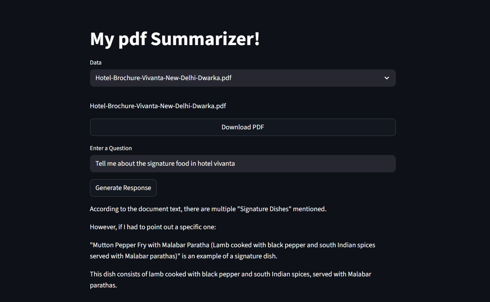

# PDF Summarizer

This project is a **PDF Summarizer** that allows users to ask questions based on uploaded PDFs.  
It uses a RAG (Retrieval-Augmented Generation) pipeline with ChromaDB and a local LLM (Ollama) to provide context-grounded answers.

---

## Pipeline

Import PDFs → Docling → ChromaDB → Streamlit UI → Ollama (llama3.2:3b) → Output

---

## Demo




---

## Libraries & Tools

- **Streamlit** — UI  
- **Docling** — PDF parsing  
- **ChromaDB** — Vector database  
- **LangChain** — RAG pipeline  
- **Ollama** — Local LLM  
- **Sentence Transformers** — Embeddings  

---

## Run LLM

Before running the app, start Ollama:

```bash
ollama run llama3.2:3b
